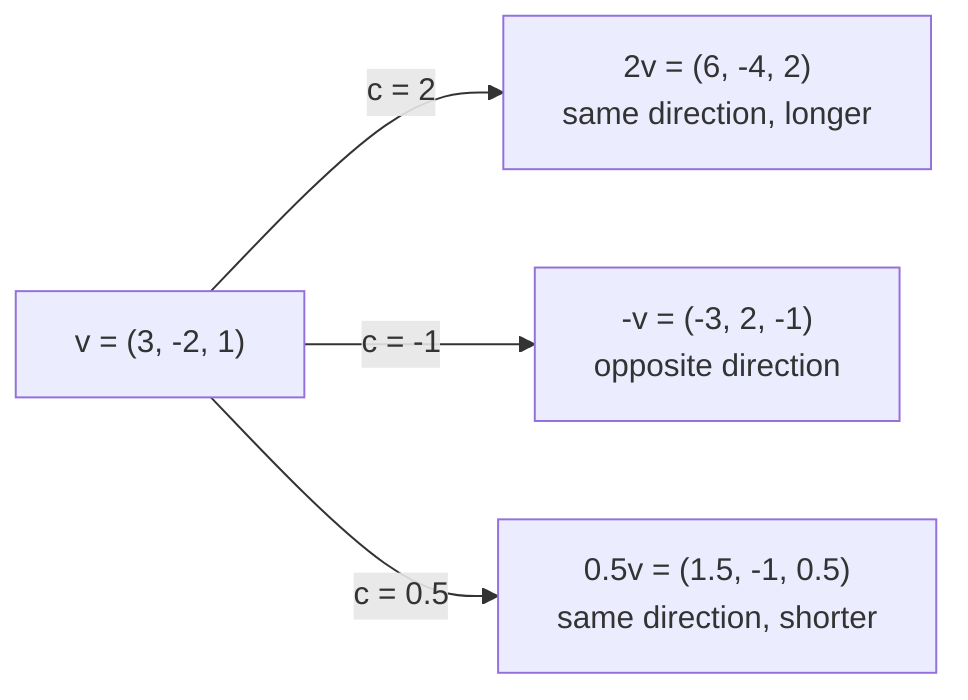
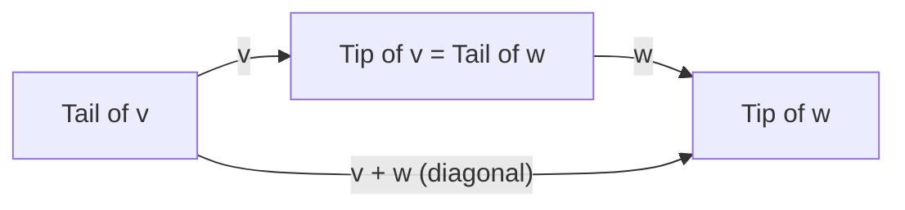
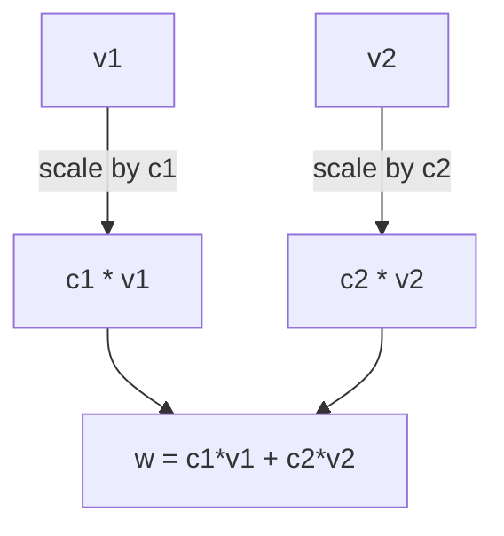
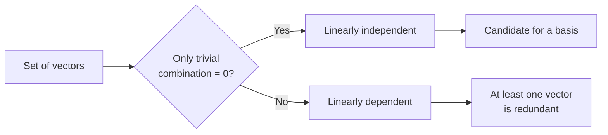

# SPL Run: build_concept_book

- **Adapter:** claude_cli
- **Model:** claude-sonnet-5
- **Tokens:** 13051 in / 7560 out
- **Latency:** 183831ms
- **Timestamp:** 2026-09-27 12:53:57

## Output

```output


---

## Column Vector

A column vector is an ordered list of $n$ complex numbers arranged vertically:
$$
\mathbf{v} = \begin{pmatrix} v_1 \\ v_2 \\ \vdots \\ v_n \end{pmatrix}, \qquad v_i \in \mathbb{C}.
$$
The vertical arrangement is not cosmetic — it fixes how the vector interacts with matrices under multiplication and how it pairs with its dual, the row vector. Column vectors live in the complex vector space $\mathbb{C}^n$, where addition and scalar multiplication proceed entrywise: $(\mathbf{u}+\mathbf{v})_i = u_i + v_i$ and $(\alpha\mathbf{v})_i = \alpha v_i$ for $\alpha \in \mathbb{C}$.

**Worked example.** Consider the two-component column vector
$$
\mathbf{\psi} = \begin{pmatrix} \frac{1}{\sqrt{2}} \\[4pt] \frac{i}{\sqrt{2}} \end{pmatrix}.
$$
To find its norm, take the conjugate transpose $\mathbf{\psi}^\dagger$ (a row vector with each entry complex-conjugated) and compute
$$
\|\mathbf{\psi}\|^2 = \mathbf{\psi}^\dagger \mathbf{\psi} = \frac{1}{\sqrt{2}}\cdot\frac{1}{\sqrt{2}} + \left(\frac{-i}{\sqrt{2}}\right)\cdot\frac{i}{\sqrt{2}} = \frac{1}{2} + \frac{1}{2} = 1.
$$
Because the squared magnitudes sum to $1$, this vector is normalized — a property essential when $\mathbf{\psi}$ represents a quantum state, where $|v_i|^2$ gives the probability of measuring outcome $i$.

**Problem-solving application.** Given
$$
\mathbf{a} = \begin{pmatrix} 3+i \\ 2-i \end{pmatrix}, \qquad \mathbf{b} = \begin{pmatrix} 1 \\ -i \end{pmatrix},
$$
find $\mathbf{a} + 2\mathbf{b}$ and the inner product $\langle \mathbf{b}, \mathbf{a}\rangle = \mathbf{b}^\dagger\mathbf{a}$. First, $2\mathbf{b} = \begin{pmatrix} 2 \\ -2i \end{pmatrix}$, so $\mathbf{a}+2\mathbf{b} = \begin{pmatrix} 5+i \\ 2-3i \end{pmatrix}$. Second, $\mathbf{b}^\dagger = (1,\ i)$, so
$$
\langle \mathbf{b}, \mathbf{a}\rangle = 1\cdot(3+i) + i\cdot(2-i) = 3+i+2i+1 = 4+3i.
$$
Notice the inner product is generally complex and not symmetric: $\langle \mathbf{a}, \mathbf{b}\rangle = \overline{\langle \mathbf{b}, \mathbf{a}\rangle}$. This conjugate-linearity is what forces the "column vector paired with conjugated row vector" convention, and it is the operation that underlies computing probabilities, projections, and expectation values throughout linear algebra and quantum mechanics.

---

## Complex Number

A complex number is an expression of the form $a + bi$, where $a$ and $b$ are real numbers and $i$ is the imaginary unit, defined by the property $i^2 = -1$. Here $a$ is called the real part and $b$ the imaginary part. Complex numbers form a field — closed under addition, subtraction, multiplication, and division (except by zero) — which is exactly what qualifies them, alongside $\mathbb{R}$, to serve as the scalar field underlying a vector space: any vector space defined "over $\mathbb{C}$" simply means its scalars are drawn from this set, and all vector space axioms (distributivity, associativity, existence of inverses) hold with complex scalars just as they do with real ones.

Arithmetic follows directly from treating $i$ as a symbol satisfying $i^2 = -1$. Addition combines real and imaginary parts separately: $(3 + 2i) + (1 - 5i) = 4 - 3i$. Multiplication uses distribution: $(2 + i)(1 - 3i) = 2 - 6i + i - 3i^2 = 2 - 5i + 3 = 5 - 5i$. Division requires the complex conjugate $\bar{a+bi} = a - bi$, used to clear the imaginary part from the denominator: for example, $\dfrac{1}{2+i} = \dfrac{2-i}{(2+i)(2-i)} = \dfrac{2-i}{5}$.

Consider a vector space over $\mathbb{C}$, such as $\mathbb{C}^2$, whose elements are pairs of complex numbers, e.g. $(3+i,\ 2-4i)$. Scalar multiplication now uses a complex scalar: multiplying $(3+i, 2-4i)$ by the scalar $i$ gives $(i(3+i),\ i(2-4i)) = (3i + i^2,\ 2i - 4i^2) = (-1+3i,\ 4+2i)$. Notice that multiplying by $i$ does not just scale a vector — over $\mathbb{R}^2$ this operation would have no analogue, since $i \notin \mathbb{R}$. This is the essential reason complex scalars matter in applications like quantum mechanics and signal processing: multiplying by $i$ acts as a "quarter-turn" in the complex plane (since $i = 1 \cdot e^{i\pi/2}$), giving vector spaces over $\mathbb{C}$ a built-in rotational structure unavailable over $\mathbb{R}$.

When solving problems in a complex vector space, always verify that scalar operations respect field closure — check that the result of any combination $\alpha v$ or $\alpha v + \beta w$ with $\alpha, \beta \in \mathbb{C}$ stays a valid complex-coordinate vector, and simplify $i^2 = -1$ immediately wherever it appears to avoid arithmetic errors.

---

## Complex Conjugate Vector

For a vector $\mathbf{v} \in \mathbb{C}^n$ with entries $v_k = a_k + b_k i$, the **complex conjugate vector** $\overline{\mathbf{v}}$ is formed by conjugating each entry individually:
$$\overline{\mathbf{v}} = \begin{pmatrix} \overline{v_1} \\ \overline{v_2} \\ \vdots \\ \overline{v_n} \end{pmatrix}, \qquad \overline{v_k} = a_k - b_k i.$$

This operation is entrywise, so it commutes with vector addition and distributes over scalar multiplication with a twist: $\overline{c\mathbf{v}} = \overline{c}\,\overline{\mathbf{v}}$ for any scalar $c \in \mathbb{C}$. The conjugate vector is the algebraic partner that makes the geometry of complex vector spaces work — without it, there is no way to define a length that is guaranteed to be a nonnegative real number.

**Worked example.** Let $\mathbf{v} = \begin{pmatrix} 2 + 3i \\ -1 - i \\ 4i \end{pmatrix}$. Conjugating each entry gives
$$\overline{\mathbf{v}} = \begin{pmatrix} 2 - 3i \\ -1 + i \\ -4i \end{pmatrix}.$$
Notice that real entries (there are none here) would be unchanged, since $\overline{a} = a$ when $b = 0$.

**Why it matters — the inner product.** In $\mathbb{C}^n$, the standard inner product is defined as $\langle \mathbf{u}, \mathbf{v} \rangle = \sum_{k=1}^n u_k \overline{v_k} = \mathbf{u}^T \overline{\mathbf{v}}$, not the naive dot product $\sum u_k v_k$. This conjugation is not a cosmetic choice: it is exactly what forces $\langle \mathbf{v}, \mathbf{v} \rangle = \sum_k v_k \overline{v_k} = \sum_k |v_k|^2 \geq 0$ to be real and nonnegative, so that a norm $\|\mathbf{v}\| = \sqrt{\langle \mathbf{v}, \mathbf{v} \rangle}$ exists. If you instead computed $\sum v_k^2$ without conjugating, the result could be negative or complex — e.g., $(2i)^2 = -4$ — and "length" would be meaningless.

**Problem-solving application.** Given $\mathbf{v} = \begin{pmatrix} 1+i \\ 2-i \end{pmatrix}$, find $\|\mathbf{v}\|$. Compute $\langle \mathbf{v}, \mathbf{v} \rangle = (1+i)\overline{(1+i)} + (2-i)\overline{(2-i)} = (1+i)(1-i) + (2-i)(2+i) = 2 + 5 = 7$, so $\|\mathbf{v}\| = \sqrt{7}$. This same conjugate-and-sum pattern is the computational core of checking orthogonality of complex eigenvectors and of verifying that a matrix is unitary ($A^*A = I$, where $A^* = \overline{A}^T$).

---

## Scalar Multiplication

Scalar multiplication takes a vector $\mathbf{v} = (v_1, v_2, \ldots, v_n)$ and a scalar $c \in \mathbb{R}$, producing a new vector $c\mathbf{v} = (cv_1, cv_2, \ldots, cv_n)$ — every entry scaled by the same factor. Geometrically, this stretches or shrinks the vector's length by $|c|$; if $c < 0$, the vector also reverses direction. If $c = 0$, the result is the zero vector regardless of the original.

**Worked example.** Let $\mathbf{v} = (3, -2, 1)$. Then:
$$2\mathbf{v} = (6, -4, 2), \qquad -1\mathbf{v} = (-3, 2, -1), \qquad 0.5\mathbf{v} = (1.5, -1, 0.5)$$
Notice that $2\mathbf{v}$ points the same direction as $\mathbf{v}$ but is twice as long, while $-\mathbf{v}$ points exactly opposite, same length. This is the defining geometric signature of scalar multiplication: it never rotates a vector off its original line, only rescales and possibly flips it.

**Why this matters — formal structure.** Scalar multiplication is one of the two operations (along with vector addition) that make $\mathbb{R}^n$ a *vector space*. It must satisfy specific axioms for every scalars $a, b$ and vectors $\mathbf{u}, \mathbf{v}$:
$$a(\mathbf{u} + \mathbf{v}) = a\mathbf{u} + a\mathbf{v}, \qquad (a+b)\mathbf{v} = a\mathbf{v} + b\mathbf{v}, \qquad a(b\mathbf{v}) = (ab)\mathbf{v}, \qquad 1\mathbf{v} = \mathbf{v}$$
These axioms are not arbitrary bookkeeping — they guarantee that *linear combinations* $c_1\mathbf{v}_1 + c_2\mathbf{v}_2 + \cdots$ behave predictably, which underlies span, linear independence, and every later concept built from combining vectors.

**Problem-solving application.** Given $\mathbf{v} = (4, 6)$, find the unit vector in the same direction. Compute $\|\mathbf{v}\| = \sqrt{4^2+6^2} = \sqrt{52}$, then scale: $\hat{\mathbf{v}} = \frac{1}{\sqrt{52}}(4,6) \approx (0.555, 0.832)$. This "normalize by scalar multiplication with $c = 1/\|\mathbf{v}\|$" technique is used constantly — in computer graphics to get surface normals, in physics to isolate direction from magnitude, and in machine learning to normalize feature vectors before computing cosine similarity.


*Scalar multiplication rescales a vector along its original line; the sign of the scalar determines whether direction is preserved or reversed.*

---

## Vector Addition

Vector addition combines two vectors by adding their corresponding components. For vectors $\mathbf{v} = (v_1, v_2, \dots, v_n)$ and $\mathbf{w} = (w_1, w_2, \dots, w_n)$ in $\mathbb{R}^n$, the sum is

$$\mathbf{v} + \mathbf{w} = (v_1 + w_1,\ v_2 + w_2,\ \dots,\ v_n + w_n).$$

This operation is only defined when both vectors have the same dimension — you cannot add a vector in $\mathbb{R}^2$ to one in $\mathbb{R}^3$. Geometrically, addition has two equivalent interpretations. In the **parallelogram rule**, $\mathbf{v}$ and $\mathbf{w}$ are drawn tail-to-tail, and their sum is the diagonal of the parallelogram they span. In the **tip-to-tail rule**, $\mathbf{w}$ is redrawn starting at the tip of $\mathbf{v}$; the sum is the vector from the tail of $\mathbf{v}$ to the new tip of $\mathbf{w}$. Both constructions produce the same resultant vector, which is why physicists use vector addition to combine forces, velocities, or displacements acting on an object.

**Worked example.** Let $\mathbf{v} = (3, 1)$ and $\mathbf{w} = (-1, 2)$. Adding componentwise:

$$\mathbf{v} + \mathbf{w} = (3 + (-1),\ 1 + 2) = (2, 3).$$

Plotted on a grid, this matches the parallelogram rule: starting at the origin, tracing $\mathbf{v}$ then $\mathbf{w}$ (tip-to-tail) lands at the point $(2,3)$, the same endpoint as tracing $\mathbf{w}$ then $\mathbf{v}$ — vector addition is commutative, $\mathbf{v} + \mathbf{w} = \mathbf{w} + \mathbf{v}$.

**Problem-solving application.** Suppose a boat's engine produces a velocity vector $\mathbf{b} = (4, 0)$ km/h (due east) and a river current adds $\mathbf{c} = (0, -3)$ km/h (due south). The boat's actual velocity relative to the shore is $\mathbf{b} + \mathbf{c} = (4, -3)$ km/h. Its speed is $|\mathbf{b}+\mathbf{c}| = \sqrt{4^2+3^2} = 5$ km/h. This illustrates the general strategy for physics and engineering problems: decompose every influence into vector components, add componentwise, then extract magnitude and direction from the resultant.


*Tip-to-tail construction: placing $\mathbf{w}$ at the tip of $\mathbf{v}$ produces the same resultant $\mathbf{v}+\mathbf{w}$ as the parallelogram diagonal from the shared tail.*

---

## Inner Product

An inner product is a rule that takes two vectors and returns a single scalar, generalizing the familiar dot product to complex vector spaces. For vectors $\mathbf{u} = (u_1, u_2, \ldots, u_n)$ and $\mathbf{v} = (v_1, v_2, \ldots, v_n)$ in $\mathbb{C}^n$, the standard inner product is

$$
\langle \mathbf{u}, \mathbf{v} \rangle = \sum_{i=1}^{n} \overline{u_i}\, v_i
$$

where $\overline{u_i}$ denotes the complex conjugate of $u_i$. Conjugating the first vector is essential, not a formality: it guarantees that $\langle \mathbf{u}, \mathbf{u} \rangle = \sum |u_i|^2$ is always a nonnegative real number, so that $\sqrt{\langle \mathbf{u}, \mathbf{u} \rangle}$ can serve as a genuine length (norm). Without conjugation, a complex vector could have "negative length," which makes no geometric sense. In real vector spaces, conjugation does nothing ($\overline{u_i} = u_i$), so the inner product reduces to the ordinary dot product.

**Worked example.** Let $\mathbf{u} = (1+i,\ 2)$ and $\mathbf{v} = (3,\ 1-i)$ in $\mathbb{C}^2$. Then

$$
\langle \mathbf{u}, \mathbf{v} \rangle = \overline{(1+i)}(3) + \overline{2}(1-i) = (1-i)(3) + 2(1-i) = (3-3i) + (2-2i) = 5 - 5i.
$$

Note the order matters: $\langle \mathbf{v}, \mathbf{u} \rangle = \overline{\langle \mathbf{u}, \mathbf{v} \rangle} = 5+5i$. This conjugate-symmetry property, $\langle \mathbf{v}, \mathbf{u} \rangle = \overline{\langle \mathbf{u}, \mathbf{v} \rangle}$, along with linearity in the second argument and positive-definiteness ($\langle \mathbf{u},\mathbf{u}\rangle \geq 0$, with equality only if $\mathbf{u} = \mathbf{0}$), defines what it means for any such rule to qualify as an inner product on a general vector space.

**Problem-solving application.** Inner products let us test orthogonality and compute projections, both essential in signal processing and quantum mechanics. To check whether $\mathbf{u} = (1, i)$ and $\mathbf{w} = (i, 1)$ are orthogonal, compute $\langle \mathbf{u}, \mathbf{w} \rangle = \overline{1}(i) + \overline{i}(1) = i + (-i)(1) = i - i = 0$. Since the inner product vanishes, the vectors are orthogonal. This same computation underlies the projection formula $\text{proj}_{\mathbf{w}} \mathbf{u} = \dfrac{\langle \mathbf{w}, \mathbf{u} \rangle}{\langle \mathbf{w}, \mathbf{w} \rangle}\, \mathbf{w}$, used to decompose signals into orthogonal components — for instance, extracting Fourier coefficients by projecting a function onto complex exponential basis vectors.

---

## Linear Combination

A **linear combination** of vectors $\mathbf{v}_1, \mathbf{v}_2, \dots, \mathbf{v}_n$ is any vector formed by scaling each one and adding the results:

$$
\mathbf{w} = c_1\mathbf{v}_1 + c_2\mathbf{v}_2 + \cdots + c_n\mathbf{v}_n
$$

where $c_1, \dots, c_n$ are scalars. This single operation — scale, then add — underlies almost all of linear algebra: it is how we describe coordinates, solve systems of equations, and build the notion of span.

**Worked example.** Let $\mathbf{v}_1 = (1, 0)$ and $\mathbf{v}_2 = (0, 1)$ in $\mathbb{R}^2$. Any vector $\mathbf{w} = (3, -2)$ is the linear combination

$$
\mathbf{w} = 3\mathbf{v}_1 + (-2)\mathbf{v}_2 = 3(1,0) - 2(0,1) = (3, -2).
$$

Here $c_1 = 3$ and $c_2 = -2$ are the coordinates of $\mathbf{w}$ relative to $\mathbf{v}_1, \mathbf{v}_2$. This is why "coordinates" and "linear combination coefficients" are really the same idea viewed from different angles.

**Problem-solving application.** Given a target vector, finding the scalars that produce it as a linear combination of given vectors is equivalent to solving a linear system. Suppose we want $\mathbf{w} = (5, 1)$ from $\mathbf{v}_1 = (1, 2)$ and $\mathbf{v}_2 = (3, -1)$. We need $c_1, c_2$ satisfying

$$
c_1(1,2) + c_2(3,-1) = (5,1) \quad\Longrightarrow\quad
\begin{cases} c_1 + 3c_2 = 5 \\ 2c_1 - c_2 = 1 \end{cases}
$$

Solving gives $c_1 = 2$, $c_2 = 1$, so $\mathbf{w} = 2\mathbf{v}_1 + \mathbf{v}_2$. If no solution exists, $\mathbf{w}$ cannot be reached by combining $\mathbf{v}_1$ and $\mathbf{v}_2$ — it lies outside their span. This test (does a solution to the resulting linear system exist?) is exactly how you determine, in general, whether one vector lies in the span of a set of others.


*Scaling $\mathbf{v}_1$ and $\mathbf{v}_2$ by $c_1$ and $c_2$ and adding the results produces $\mathbf{w}$, which lies in the span of $\mathbf{v}_1$ and $\mathbf{v}_2$.*

---

## Orthogonal Vectors

Two vectors $\mathbf{u}$ and $\mathbf{v}$ in $\mathbb{R}^n$ are **orthogonal** if their inner product vanishes:
$$\mathbf{u} \cdot \mathbf{v} = \sum_{i=1}^n u_i v_i = 0.$$

Geometrically, this generalizes the notion of perpendicularity. Recall that $\mathbf{u} \cdot \mathbf{v} = \|\mathbf{u}\|\|\mathbf{v}\|\cos\theta$, where $\theta$ is the angle between the vectors. Since $\|\mathbf{u}\|, \|\mathbf{v}\| > 0$ for nonzero vectors, the dot product is zero exactly when $\cos\theta = 0$, i.e., $\theta = 90°$. Orthogonality is what makes the dot product test purely algebraic: no need to compute an angle at all.

**Worked example.** Let $\mathbf{u} = (2, -1, 3)$ and $\mathbf{v} = (1, 5, 1)$. Their dot product is
$$\mathbf{u} \cdot \mathbf{v} = (2)(1) + (-1)(5) + (3)(1) = 2 - 5 + 3 = 0.$$
Since the dot product is zero, $\mathbf{u}$ and $\mathbf{v}$ are orthogonal — even though nothing about their coordinates looks "perpendicular" at a glance. This is the power of the algebraic definition: it applies uniformly in any dimension, where a visual check is impossible.

**Problem-solving application.** Orthogonality is the engine behind projections, least-squares fitting, and orthogonal bases (like the standard basis $\mathbf{e}_1, \mathbf{e}_2, \dots, \mathbf{e}_n$, where every pair satisfies $\mathbf{e}_i \cdot \mathbf{e}_j = 0$ for $i \neq j$). A common task: given a vector $\mathbf{w}$, find a vector orthogonal to it. If $\mathbf{w} = (a, b)$ in $\mathbb{R}^2$, then $\mathbf{w}^\perp = (-b, a)$ always satisfies $\mathbf{w} \cdot \mathbf{w}^\perp = -ab + ba = 0$ — a construction used constantly in computer graphics (surface normals), physics (decomposing forces into perpendicular components), and statistics (orthogonal regression residuals). In higher dimensions, orthogonality is verified the same way: compute the dot product and check it equals zero, regardless of how large $n$ is.


*The dot product test for orthogonality: zero inner product corresponds to a 90° angle between vectors.*

---

## Relation Of Linear Dependence

A **relation of linear dependence** among vectors $\mathbf{v}_1, \mathbf{v}_2, \dots, \mathbf{v}_n$ is a true equation of the form

$$c_1\mathbf{v}_1 + c_2\mathbf{v}_2 + \cdots + c_n\mathbf{v}_n = \mathbf{0}$$

in which at least one coefficient $c_i$ is nonzero. If the *only* choice of scalars satisfying this equation is $c_1 = c_2 = \cdots = c_n = 0$ — the **trivial relation** — then the vectors are called linearly independent. If a nontrivial relation exists, the vectors are linearly dependent, and the relation itself is the explicit certificate of that dependence: it tells you exactly how one vector can be rewritten in terms of the others.

**Worked example.** Let $\mathbf{v}_1 = (1, 2, 3)$, $\mathbf{v}_2 = (2, 4, 6)$, and $\mathbf{v}_3 = (1, 0, 1)$. Try to solve $c_1\mathbf{v}_1 + c_2\mathbf{v}_2 + c_3\mathbf{v}_3 = \mathbf{0}$. Since $\mathbf{v}_2 = 2\mathbf{v}_1$, choosing $c_1 = 2,\ c_2 = -1,\ c_3 = 0$ gives

$$2(1,2,3) - 1(2,4,6) + 0(1,0,1) = (0,0,0).$$

This is a genuine relation of linear dependence, since not all coefficients are zero. It reveals that $\mathbf{v}_2$ is redundant: $\mathbf{v}_2 = 2\mathbf{v}_1$, so $\{\mathbf{v}_1,\mathbf{v}_2,\mathbf{v}_3\}$ spans no more than $\{\mathbf{v}_1,\mathbf{v}_3\}$ does alone.

**Problem-solving application.** Finding a relation of linear dependence is a computational task: form the matrix $A$ whose columns are the given vectors, row-reduce $A$ to echelon form, and identify the free variables in the homogeneous system $A\mathbf{c} = \mathbf{0}$. Each free variable, set to a nonzero value, generates a nontrivial relation. This is the standard method for pruning a spanning set down to a basis — whenever row reduction produces a free column, the corresponding vector is expressible via the others and can be discarded without shrinking the span. Conversely, if row reduction of $A$ yields *no* free variables (every column is a pivot column), the only solution is $\mathbf{c} = \mathbf{0}$, confirming independence. This link between relations of linear dependence and pivot structure is what makes checking independence and constructing a basis a mechanical, algorithmic process rather than a guessing game.

---

## Linear Independence

A set of vectors $\{v_1, v_2, \dots, v_n\}$ in a vector space $V$ is **linearly independent** if the only scalars $c_1, c_2, \dots, c_n$ satisfying

$$c_1 v_1 + c_2 v_2 + \cdots + c_n v_n = 0$$

are $c_1 = c_2 = \cdots = c_n = 0$ — the *trivial* solution. If some other combination of scalars, not all zero, also produces the zero vector, the set is **linearly dependent**: at least one vector can be written as a combination of the others, so it carries no new directional information.

**Worked example.** Consider $v_1 = (1, 2, 3)$, $v_2 = (0, 1, 4)$, $v_3 = (2, 1, -2)$ in $\mathbb{R}^3$. Set up $c_1 v_1 + c_2 v_2 + c_3 v_3 = 0$ and solve:

$$
\begin{aligned}
c_1 + 2c_3 &= 0 \\
2c_1 + c_2 + c_3 &= 0 \\
3c_1 + 4c_2 - 2c_3 &= 0
\end{aligned}
$$

Row-reducing the coefficient matrix $\begin{bmatrix} 1 & 0 & 2 \\ 2 & 1 & 1 \\ 3 & 4 & -2 \end{bmatrix}$ yields a unique solution $c_1 = c_2 = c_3 = 0$ (the matrix has full rank 3, hence nonzero determinant). Since no nontrivial combination vanishes, the three vectors are linearly independent — and because there are exactly three of them in $\mathbb{R}^3$, they form a basis.

**Why this matters — the practical test.** For $n$ vectors in $\mathbb{R}^n$, linear independence is equivalent to the matrix formed from them (as columns) having a nonzero determinant, or equivalently, having rank $n$. This equivalence is the workhorse test used throughout linear algebra: checking independence reduces to Gaussian elimination or determinant computation, both of which are algorithmic and machine-checkable.

**Problem-solving application.** Linear independence determines whether a spanning set is "wasteful." Given vectors that span a subspace, discarding any that are linear combinations of the others (i.e., removing dependencies) yields a minimal spanning set — a basis. This is exactly the procedure behind dimensionality reduction: identifying and eliminating redundant directions in a dataset, retaining only the independent ones needed to reconstruct all the information.



*Decision flow for testing and interpreting linear independence.*

---

## Orthogonal Set

A set of vectors $\{v_1, v_2, \dots, v_k\}$ in $\mathbb{R}^n$ is an **orthogonal set** if every pair of distinct vectors in the set is orthogonal — that is,

$$
v_i \cdot v_j = 0 \quad \text{whenever } i \neq j.
$$

No condition is placed on the vectors' lengths; they need not be unit vectors (a set that is orthogonal *and* consists of unit vectors is called **orthonormal**). Orthogonal sets matter because, provided none of the vectors is the zero vector, they are automatically **linearly independent** — a fact that follows directly from the definition. Suppose $c_1 v_1 + c_2 v_2 + \cdots + c_k v_k = 0$. Taking the dot product of both sides with $v_i$ eliminates every term except the $i$-th, since $v_i \cdot v_j = 0$ for $j \neq i$:

$$
c_i (v_i \cdot v_i) = 0.
$$

Since $v_i \neq 0$, $v_i \cdot v_i > 0$, forcing $c_i = 0$ for every $i$. Hence the only linear combination equal to zero is the trivial one, and the set is independent. A nonzero orthogonal set of $n$ vectors in $\mathbb{R}^n$ therefore automatically forms a basis, called an **orthogonal basis**.

**Worked example.** Consider $v_1 = (1, 1, 0)$, $v_2 = (1, -1, 1)$, $v_3 = (-1, 1, 2)$ in $\mathbb{R}^3$. Check pairwise dot products: $v_1 \cdot v_2 = 1 - 1 + 0 = 0$; $v_1 \cdot v_3 = -1 + 1 + 0 = 0$; $v_2 \cdot v_3 = -1 - 1 + 2 = 0$. All three vanish, so $\{v_1, v_2, v_3\}$ is an orthogonal set, and since none is zero, it is a basis for $\mathbb{R}^3$.

**Problem-solving application.** Orthogonal bases make coordinate computation dramatically easier than general bases. To write a vector $y$ as $y = c_1 v_1 + \cdots + c_k v_k$, an arbitrary basis requires solving a linear system. With an orthogonal basis, dot both sides with $v_i$ and use orthogonality to isolate

$$
c_i = \frac{y \cdot v_i}{v_i \cdot v_i}.
$$

For instance, to express $y = (2, 3, 4)$ in the basis above: $c_1 = \frac{(2)(1)+(3)(1)}{2} = 2.5$, $c_2 = \frac{2-3+4}{3} = 1$, $c_3 = \frac{-2+3+8}{6} = 1.5$ — no matrix inversion needed. This projection formula is the computational engine behind least-squares approximation and the Gram–Schmidt process.

---

## Gram Schmidt Procedure

Given a set of linearly independent vectors $\{\mathbf{v}_1, \mathbf{v}_2, \ldots, \mathbf{v}_n\}$ spanning a subspace, the Gram-Schmidt procedure constructs an orthogonal set $\{\mathbf{u}_1, \mathbf{u}_2, \ldots, \mathbf{u}_n\}$ with the same span, by systematically subtracting off components already accounted for. Define

$$\mathbf{u}_1 = \mathbf{v}_1, \qquad \mathbf{u}_k = \mathbf{v}_k - \sum_{j=1}^{k-1} \operatorname{proj}_{\mathbf{u}_j}(\mathbf{v}_k), \quad \text{where} \quad \operatorname{proj}_{\mathbf{u}_j}(\mathbf{v}_k) = \frac{\langle \mathbf{v}_k, \mathbf{u}_j \rangle}{\langle \mathbf{u}_j, \mathbf{u}_j \rangle}\mathbf{u}_j.$$

Each new vector $\mathbf{u}_k$ is what remains of $\mathbf{v}_k$ after removing its shadow along every previously built direction, guaranteeing $\langle \mathbf{u}_k, \mathbf{u}_j \rangle = 0$ for all $j < k$. Normalizing each $\mathbf{u}_k$ (dividing by its length) yields an orthonormal basis.

**Worked example.** Let $\mathbf{v}_1 = (1, 1, 0)$ and $\mathbf{v}_2 = (2, 0, 1)$. Set $\mathbf{u}_1 = (1,1,0)$. Compute the projection of $\mathbf{v}_2$ onto $\mathbf{u}_1$:

$$\operatorname{proj}_{\mathbf{u}_1}(\mathbf{v}_2) = \frac{2}{2}(1,1,0) = (1,1,0).$$

Then $\mathbf{u}_2 = \mathbf{v}_2 - (1,1,0) = (1,-1,1)$. Check: $\langle \mathbf{u}_1, \mathbf{u}_2 \rangle = 1 - 1 + 0 = 0$. The pair $\{(1,1,0), (1,-1,1)\}$ spans the same plane as $\{\mathbf{v}_1, \mathbf{v}_2\}$ but is now orthogonal.

**Problem-solving application.** This algorithm is the computational engine behind the QR decomposition: writing a matrix $A$ (whose columns are $\mathbf{v}_1, \ldots, \mathbf{v}_n$) as $A = QR$, where $Q$ has orthonormal columns and $R$ is upper triangular recording the projection coefficients used above. QR decomposition, in turn, is the standard numerically stable method for solving least-squares regression problems, since it avoids forming the ill-conditioned matrix $A^TA$ directly. It is also the key step in constructing an orthonormal basis for eigenvalue algorithms and in verifying whether a proposed set of vectors is independent — if any $\mathbf{u}_k$ comes out as the zero vector, the original set was dependent.


*Each step removes the components already captured by prior orthogonal vectors, leaving a mutually perpendicular set spanning the original space.*

---

## Payoff

The Gram-Schmidt procedure takes any linearly independent set of vectors $\{v_1, v_2, \dots, v_n\}$ and systematically converts it into an orthonormal set $\{e_1, e_2, \dots, e_n\}$ that spans the same subspace. It does this by subtracting off, one vector at a time, whatever component already lies along the directions built so far:

$$
u_k = v_k - \sum_{i=1}^{k-1} \operatorname{proj}_{e_i}(v_k), \qquad e_k = \frac{u_k}{\|u_k\|}
$$

The result is a basis where every vector is perpendicular to every other and has unit length — the most well-behaved coordinate system a vector space can have. This is why the procedure sits at the end of the course rather than in the middle: it is not one more technique alongside determinants, eigenvalues, and matrix factorizations — it is the tool that makes all of them tractable in practice. An orthonormal basis turns projection into a dot product, turns matrix inversion into a transpose, and turns numerical error from a compounding liability into a controlled, bounded quantity.

That is the payoff, and it explains why the concept unlocks so much downstream work. In least-squares regression, orthonormalizing the design matrix (via QR decomposition, which *is* Gram-Schmidt run on the columns of a matrix) turns an ill-conditioned normal-equations solve into a stable back-substitution. In computer graphics and robotics, orthonormal frames built from Gram-Schmidt keep rotation matrices numerically valid after thousands of incremental updates, preventing skewing or drift. In signal processing, orthonormal basis expansions (Fourier-like decompositions) rely on the same subtraction-of-projections logic to isolate independent frequency components. In quantum mechanics, physically valid basis states must be orthonormal, and Gram-Schmidt is the constructive method for enforcing that on an arbitrary set of trial wavefunctions. In machine learning, whitening and decorrelating feature vectors before training — a common preprocessing step — is Gram-Schmidt applied to a data matrix's columns.

In every one of these cases, the underlying question is the same one this procedure answers: given a set of directions that overlap and interfere with each other, how do you rebuild them so each one carries independent, measurable information? That question is worth sitting with directly. Take the QR decomposition of a matrix as your next stop — implement Gram-Schmidt by hand on a $3\times 3$ system, compare it numerically to a library's `qr()` function, and watch where floating-point roundoff causes the two to disagree.
```
