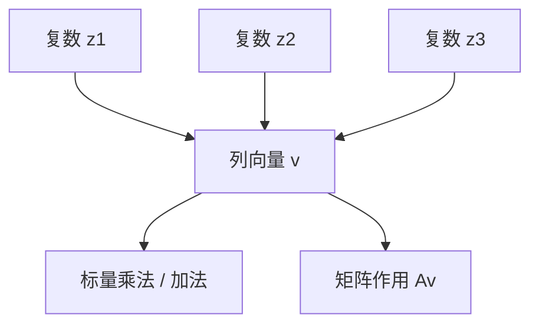
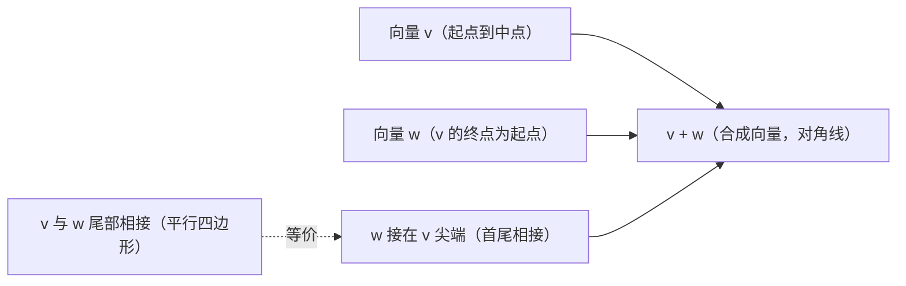
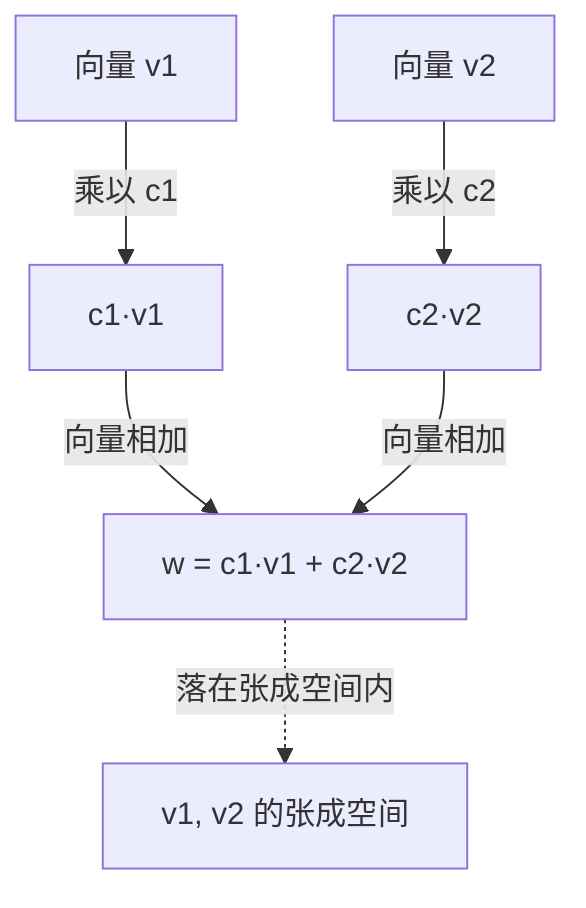

# SPL Run: build_concept_book

- **Adapter:** claude_cli
- **Model:** claude-sonnet-5
- **Tokens:** 13113 in / 4166 out
- **Latency:** 217414ms
- **Timestamp:** 2026-09-27 20:09:18

## Output

```output


---

## Column Vector

列向量是将若干个复数按固定顺序竖直排列所构成的对象，记作

$$
v = \begin{pmatrix} z_1 \\ z_2 \\ \vdots \\ z_n \end{pmatrix}, \quad z_i \in \mathbb{C}
$$

其中每个 $z_i$ 称为该向量的第 $i$ 个分量。与"一组数"不同，列向量强调**顺序**与**位置**：分量的排列方式本身携带信息，交换两个分量的位置会得到一个不同的向量。这种结构使列向量成为线性代数中表示状态、坐标或量子态的基本载体——例如量子计算中，一个量子比特的状态就写成一个二维复数列向量。

**运算规则**：两个同维数的列向量可以逐分量相加；列向量可以与一个标量（实数或复数）相乘，即每个分量都乘以该标量：

$$
v + w = \begin{pmatrix} z_1+w_1 \\ \vdots \\ z_n+w_n \end{pmatrix}, \qquad
\alpha v = \begin{pmatrix} \alpha z_1 \\ \vdots \\ \alpha z_n \end{pmatrix}
$$

**范例**：设

$$
v = \begin{pmatrix} 1+i \\ 2 \\ -i \end{pmatrix}, \qquad w = \begin{pmatrix} i \\ 1-i \\ 3 \end{pmatrix}
$$

则

$$
v + 2w = \begin{pmatrix} (1+i)+2i \\ 2+2(1-i) \\ -i+6 \end{pmatrix} = \begin{pmatrix} 1+3i \\ 4-2i \\ 6-i \end{pmatrix}
$$

**问题求解应用**：在实际计算中，列向量常用于编码问题的多个未知量，使得批量运算（加法、缩放、后续的矩阵变换）可以一次性对整组数据完成，而不必逐个处理。例如，若要将三个复数信号 $z_1, z_2, z_3$ 同时放大 $\alpha$ 倍并叠加另一组偏移信号，只需对列向量做一次标量乘法与加法，而无需写三条独立的方程——这正是矩阵作用于列向量（$Av$）能够高效描述线性变换的基础，也是后续学习矩阵乘法、基变换与量子门操作时反复使用的表示方式。



*该图展示多个复数按顺序组合为一个列向量，并作为标量运算与矩阵变换的输入对象。*

---

## Complex Number

**定义**

复数是形如 $a + bi$ 的数，其中 $a, b \in \mathbb{R}$ 分别称为实部与虚部，$i$ 满足 $i^2 = -1$。全体复数构成集合 $\mathbb{C}$，它是实数域 $\mathbb{R}$ 的扩张：每个实数都是虚部为零的复数，而每个复数都可以看作平面上的一个点 $(a, b)$——这就是**复平面**（Argand 平面）的几何图像，横轴为实轴，纵轴为虚轴。

在本章中，复数之所以重要，是因为它可以作为向量空间的**标量域**。也就是说，向量的分量不必是实数，而可以是复数，此时向量空间称为**复向量空间**，记作 $\mathbb{C}^n$。向量的加法与数乘规则完全相同，只是标量乘法现在允许用复数 $\lambda = c + di$ 去缩放向量：
$$
\lambda(a_1 + b_1 i,\, a_2 + b_2 i, \dots) = (\lambda a_1 + \lambda b_1 i,\, \lambda a_2 + \lambda b_2 i, \dots)
$$

**运算规则（几何意义）**

复数加法对应平面上向量的平移相加；复数乘法则同时改变**模长**（缩放）与**幅角**（旋转）。若 $z = a + bi$，其模长为 $|z| = \sqrt{a^2 + b^2}$，幅角 $\theta = \arg(z)$ 满足 $z = |z|(\cos\theta + i\sin\theta)$。两个复数相乘时，模长相乘、幅角相加——这正是复数域比实数域"多出"的旋转结构，也是它能自然编码向量空间中旋转与相位的原因。

**例题**：设 $\lambda = 1 + i$，向量 $\mathbf{v} = (2, \, 1 - i) \in \mathbb{C}^2$。求 $\lambda \mathbf{v}$。

计算：$\lambda \cdot 2 = 2 + 2i$；$\lambda \cdot (1-i) = (1+i)(1-i) = 1 - i^2 = 1 + 1 = 2$。
所以 $\lambda \mathbf{v} = (2 + 2i,\ 2)$。

**问题求解应用**

在复向量空间中，判断一组向量是否线性无关、是否张成空间，方法与实数域完全一致，只是消元运算中的系数是复数。例如解方程 $\lambda_1(1, i) + \lambda_2(i, -1) = (0, 0)$（$\lambda_1, \lambda_2 \in \mathbb{C}$），代入第一分量 $\lambda_1 + i\lambda_2 = 0 \Rightarrow \lambda_1 = -i\lambda_2$，代入第二分量验证 $i\lambda_1 - \lambda_2 = i(-i\lambda_2) - \lambda_2 = \lambda_2 - \lambda_2 = 0$ 恒成立，故存在非零解，两向量线性相关。这提醒我们：换标量域后，"无关性"的判断结果可能与在 $\mathbb{R}$ 上不同——这正是复数域作为标量域的实际意义所在。

---

## Complex Conjugate Vector

**定义**

设 $\mathbf{v} \in \mathbb{C}^n$ 是一个复向量，其分量为 $v_1, v_2, \dots, v_n$，每个 $v_k = a_k + b_k i$（其中 $a_k, b_k \in \mathbb{R}$）。则 $\mathbf{v}$ 的**复共轭向量**（complex conjugate vector）定义为对每个分量取复共轭所得的新向量：

$$
\overline{\mathbf{v}} = \begin{pmatrix} \overline{v_1} \\ \overline{v_2} \\ \vdots \\ \overline{v_n} \end{pmatrix}, \quad \text{其中 } \overline{v_k} = a_k - b_k i
$$

也就是说，虚部整体取反，实部保持不变。这个运算是逐分量（entrywise）进行的，不涉及向量的整体几何变换，只是对每个数值取镜像。

**为什么需要它**

复共轭向量在计算复向量的"长度"（范数）时是不可或缺的工具。对于实向量，长度平方是各分量平方之和；但对复数分量而言，$v_k^2$ 本身可能是复数，不能保证非负。于是我们改用 $v_k \overline{v_k} = |v_k|^2$，这总是非负实数。将此推广到向量，就得到内积公式：

$$
\langle \mathbf{v}, \mathbf{v} \rangle = \mathbf{v}^{\!\top} \overline{\mathbf{v}} = \sum_{k=1}^n v_k \overline{v_k} = \sum_{k=1}^n |v_k|^2
$$

这正是复向量范数 $\|\mathbf{v}\|$ 平方的定义基础，广泛应用于量子力学的态矢量归一化、信号处理中的傅里叶变换幅值计算等场景。

**例题**

设 $\mathbf{v} = \begin{pmatrix} 3+4i \\ 1-2i \\ -5i \end{pmatrix}$，求 $\overline{\mathbf{v}}$，并计算 $\|\mathbf{v}\|^2$。

**解**：逐分量取共轭：

$$
\overline{\mathbf{v}} = \begin{pmatrix} 3-4i \\ 1+2i \\ 5i \end{pmatrix}
$$

计算 $\|\mathbf{v}\|^2 = \mathbf{v}^{\!\top}\overline{\mathbf{v}}$：

$$
(3+4i)(3-4i) + (1-2i)(1+2i) + (-5i)(5i)
$$
$$
= (9+16) + (1+4) + 25 = 25 + 5 + 25 = 55
$$

所以 $\|\mathbf{v}\| = \sqrt{55}$。

**问题解决应用**

在判断一个矩阵是否为**厄米矩阵**（Hermitian matrix，满足 $A = \overline{A}^{\!\top}$）时，复共轭向量是关键构件：通过对特征向量取共轭并与原向量做内积，可以验证特征值必为实数——这是量子力学中可观测量必须用厄米算子表示的数学根源。掌握复共轭向量的逐分量运算，是理解复内积空间、酉矩阵及谱定理的第一步。

---

## Scalar Multiplication（标量乘法）

**定义**

标量乘法是指用一个固定的标量（scalar，即一个实数）$c$ 去乘以向量 $\mathbf{v}$ 的每一个分量，得到一个新的向量。设

$$
\mathbf{v} = \begin{pmatrix} v_1 \\ v_2 \\ \vdots \\ v_n \end{pmatrix}, \qquad c \in \mathbb{R}
$$

则标量乘法定义为

$$
c\mathbf{v} = \begin{pmatrix} cv_1 \\ cv_2 \\ \vdots \\ cv_n \end{pmatrix}
$$

从几何角度看，标量乘法改变的是向量的**长度**（模），而不改变（或反转）它的**方向**：当 $c>1$ 时，向量被拉伸；当 $0<c<1$ 时，向量被压缩；当 $c<0$ 时，向量的方向反转 $180°$，长度按 $|c|$ 缩放；当 $c=0$ 时，结果是零向量。这一点可以由模长公式验证：$\|c\mathbf{v}\| = |c| \cdot \|\mathbf{v}\|$。

**实例演算**

设 $\mathbf{v} = \begin{pmatrix} 3 \\ -2 \end{pmatrix}$，取 $c = 2$，则

$$
2\mathbf{v} = \begin{pmatrix} 2 \times 3 \\ 2 \times (-2) \end{pmatrix} = \begin{pmatrix} 6 \\ -4 \end{pmatrix}
$$

新向量的方向与原向量完全相同，但长度是原来的 $2$ 倍。若取 $c = -1$，则 $-\mathbf{v} = \begin{pmatrix} -3 \\ 2 \end{pmatrix}$，方向恰好相反，长度不变。

**问题求解应用**

标量乘法是构造**线性组合**与判断**线性相关性**的基础工具。例如，判断向量 $\mathbf{u} = \begin{pmatrix}2\\4\end{pmatrix}$ 与 $\mathbf{w} = \begin{pmatrix}1\\2\end{pmatrix}$ 是否共线（线性相关），只需求是否存在标量 $c$ 使得 $\mathbf{u} = c\mathbf{w}$。观察分量比值 $2/1 = 2$ 且 $4/2 = 2$，比值一致，故取 $c=2$，两向量确实共线。

在实际应用中，标量乘法也用于**归一化**：将任意非零向量 $\mathbf{v}$ 转化为单位向量，只需取 $c = 1/\|\mathbf{v}\|$，计算 $c\mathbf{v}$，即可得到方向相同但长度为 $1$ 的向量，这在计算机图形学和机器学习的特征归一化中被广泛使用。

---

## Vector Addition

**定义**

设 $\mathbf{v} = (v_1, v_2, \dots, v_n)$ 和 $\mathbf{w} = (w_1, w_2, \dots, w_n)$ 是两个维数相同的向量，则它们的和定义为对应分量相加所得的新向量：

$$\mathbf{v} + \mathbf{w} = (v_1 + w_1,\ v_2 + w_2,\ \dots,\ v_n + w_n)$$

这一运算要求两个向量维数完全一致——维数不同的向量无法相加。向量加法满足交换律 $\mathbf{v}+\mathbf{w}=\mathbf{w}+\mathbf{v}$ 和结合律 $(\mathbf{u}+\mathbf{v})+\mathbf{w}=\mathbf{u}+(\mathbf{v}+\mathbf{w})$，这两条性质保证了多个向量相加时不必关心运算顺序。

**几何意义**同样重要：在平面或空间中，向量加法对应"平行四边形法则"或等价的"首尾相接法则"（见下方示意图）。这不是巧合，而是因为向量的分量表示与几何位移表示本质上是同一个数学对象的两种描述方式。

**范例**

设 $\mathbf{v} = (3, 1)$，表示一个物体先向东移动 3 单位、向北移动 1 单位；再设 $\mathbf{w} = (-1, 2)$，表示随后向西移动 1 单位、向北移动 2 单位。两次位移的合成结果为：

$$\mathbf{v} + \mathbf{w} = (3+(-1),\ 1+2) = (2, 3)$$

也就是说，无论中途路径如何，物体最终净位移等价于直接从起点移动到 $(2,3)$ 这一点。

**问题求解应用**

向量加法是解决"合成"类问题的核心工具，尤其在物理学中用于求合力、合速度或合位移。例如，若一物体同时受到力 $\mathbf{F}_1 = (4, 0)$ 牛顿和 $\mathbf{F}_2 = (0, 3)$ 牛顿的作用，则合力为 $\mathbf{F}_1 + \mathbf{F}_2 = (4, 3)$ 牛顿，其大小可进一步通过向量的模 $\|\mathbf{F}\| = \sqrt{4^2+3^2} = 5$ 牛顿求得。在实际问题中，先将各分力/位移分解为坐标分量，再逐分量相加，最后合成结果——这一"分解—相加—合成"的三步策略，是处理多向量叠加问题的通用方法。


*图示：平行四边形法则中，$\mathbf{v}$ 与 $\mathbf{w}$ 尾部对齐所构成平行四边形的对角线即为 $\mathbf{v}+\mathbf{w}$；首尾相接法则给出完全相同的结果向量。*

---

## Inner Product

**定义**：给定复向量空间中的两个向量 $\mathbf{u}, \mathbf{v} \in \mathbb{C}^n$，其内积定义为

$$\langle \mathbf{u}, \mathbf{v} \rangle = \sum_{i=1}^{n} \overline{u_i}\, v_i$$

其中 $\overline{u_i}$ 表示 $u_i$ 的复共轭。对于实向量空间，共轭不起作用（实数的共轭是其本身），内积退化为熟悉的点积 $\mathbf{u} \cdot \mathbf{v} = \sum u_i v_i$。内积具有三条公理性质：**共轭对称性**（$\langle \mathbf{u}, \mathbf{v} \rangle = \overline{\langle \mathbf{v}, \mathbf{u} \rangle}$）、**第二变元线性**、以及**正定性**（$\langle \mathbf{u}, \mathbf{u} \rangle \geq 0$，且等号仅在 $\mathbf{u} = \mathbf{0}$ 时成立）。正定性保证了由内积诱导的范数 $\|\mathbf{u}\| = \sqrt{\langle \mathbf{u}, \mathbf{u} \rangle}$ 是良定义的实数，这也是为何复向量必须取共轭——若不取共轭，$\langle \mathbf{u}, \mathbf{u} \rangle = \sum u_i^2$ 对复数而言可能为负或为复数，范数便失去意义。

**推导实例**：设 $\mathbf{u} = (1, 2i)$，$\mathbf{v} = (3, i)$。则

$$\langle \mathbf{u}, \mathbf{v} \rangle = \overline{1} \cdot 3 + \overline{2i} \cdot i = 1 \cdot 3 + (-2i)(i) = 3 - 2i^2 = 3 + 2 = 5$$

注意结果是实数——这并非巧合：当 $\mathbf{u} = \mathbf{v}$ 时，共轭对称性强制 $\langle \mathbf{u}, \mathbf{u}\rangle$ 必为实数，这正是范数存在的前提。

**问题求解应用**：内积是判断正交性、构造投影、以及量子力学中计算测量概率幅的核心工具。例如，在 Gram-Schmidt 正交化中，从向量 $\mathbf{v}$ 中减去其在已正交化基向量 $\mathbf{e}_k$ 方向上的分量，用的正是投影公式

$$\text{proj}_{\mathbf{e}_k}(\mathbf{v}) = \langle \mathbf{e}_k, \mathbf{v} \rangle \, \mathbf{e}_k$$

在量子计算中，若 $|\psi\rangle$ 是量子态、$|0\rangle$ 是测量基态，则测得 $|0\rangle$ 的概率是 $|\langle 0 | \psi \rangle|^2$——这里的共轭恰好保证了概率是非负实数。掌握内积的共轭约定，是正确理解酉矩阵、正交基与量子态叠加的必经之路。

---

## Linear Combination

**定义**

给定一组向量 $\mathbf{v}_1, \mathbf{v}_2, \ldots, \mathbf{v}_n$（同属某个向量空间）以及一组标量 $c_1, c_2, \ldots, c_n$（实数或复数），它们的**线性组合**定义为

$$
\mathbf{w} = c_1 \mathbf{v}_1 + c_2 \mathbf{v}_2 + \cdots + c_n \mathbf{v}_n
$$

这里的两种基本运算——标量乘法（拉伸或压缩每个向量）与向量加法（首尾相接求和）——是线性代数中几乎所有结构（张成空间、线性无关、基、线性变换）得以定义的出发点。系数 $c_i$ 可以取任意实数，包括零或负数，因此线性组合既能"缩短"某个方向的贡献，也能将其反向。

**范例**

设 $\mathbf{v}_1 = (1, 0)$，$\mathbf{v}_2 = (0, 1)$，取 $c_1 = 3$，$c_2 = -2$。则

$$
\mathbf{w} = 3(1,0) + (-2)(0,1) = (3, -2)
$$

事实上，平面上任意向量 $(x, y)$ 都可以写成 $x\mathbf{v}_1 + y\mathbf{v}_2$，这说明 $\{\mathbf{v}_1, \mathbf{v}_2\}$ 张成了整个平面——每个平面向量都是它们的某个线性组合。

**应用于问题求解**

线性组合的核心用途是判断一个向量能否由给定的一组向量"表示"出来。例如，问：$(4, 1)$ 能否表示为 $\mathbf{u} = (1, 2)$ 与 $\mathbf{v} = (2, -1)$ 的线性组合？设 $c_1\mathbf{u} + c_2\mathbf{v} = (4,1)$，展开得方程组：

$$
\begin{cases} c_1 + 2c_2 = 4 \\ 2c_1 - c_2 = 1 \end{cases}
$$

解得 $c_1 = \frac{6}{5}$，$c_2 = \frac{7}{5}$——存在唯一解，说明 $(4,1)$ 确实是 $\mathbf{u}, \mathbf{v}$ 的线性组合。这类"能否表示"的问题正是求解线性方程组的几何意义：方程组有解，等价于目标向量落在这些向量所张成的空间（span）之中。


*图示：向量 $\mathbf{v}_1$ 与 $\mathbf{v}_2$ 分别按系数 $c_1$、$c_2$ 缩放后相加，得到的结果 $\mathbf{w}$ 位于二者所张成的空间之中。*

---

## Orthogonal Vectors

**定义**

设 $\mathbf{u}, \mathbf{v} \in \mathbb{R}^n$ 为两个非零向量。若它们的内积（点积）为零，即

$$\mathbf{u} \cdot \mathbf{v} = \sum_{i=1}^{n} u_i v_i = 0$$

则称 $\mathbf{u}$ 与 $\mathbf{v}$ **正交**（orthogonal）。几何上，这等价于两向量之间的夹角 $\theta$ 满足 $\cos\theta = 0$，即 $\theta = 90°$。这是"垂直"概念在任意维度空间中的推广：在二维、三维空间中正交就是我们熟悉的垂直，而在更高维空间中，正交向量之间不再有直观的"图像"，但内积为零这一代数条件依然完全刻画了这种关系。

**范例**

考虑 $\mathbf{u} = (1, 2, -1)$ 和 $\mathbf{v} = (3, -1, 1)$。计算内积：

$$\mathbf{u} \cdot \mathbf{v} = (1)(3) + (2)(-1) + (-1)(1) = 3 - 2 - 1 = 0$$

因此 $\mathbf{u}$ 与 $\mathbf{v}$ 正交。再看 $\mathbf{w} = (1, 1, 1)$：$\mathbf{u} \cdot \mathbf{w} = 1 + 2 - 1 = 2 \neq 0$，故 $\mathbf{u}$ 与 $\mathbf{w}$ 不正交。

**解题应用**

正交性的核心用途在于**判定与构造**。判定类问题：给定若干向量，快速用内积检验是否两两正交，这是构造正交基、简化线性方程组求解的第一步。构造类问题：已知 $\mathbf{u} = (2, 1)$，求与其正交的所有向量。设 $\mathbf{v} = (x, y)$，则需 $2x + y = 0$，即 $y = -2x$。于是所有正交于 $\mathbf{u}$ 的向量都形如 $(x, -2x) = x(1, -2)$，构成一条过原点的直线（一维子空间）。这说明：在 $\mathbb{R}^2$ 中，与给定非零向量正交的向量集合恰好构成一个一维子空间；在 $\mathbb{R}^n$ 中，与一个非零向量正交的所有向量构成一个 $(n-1)$ 维子空间，称为该向量的**正交补**。

正交性的重要性质是：一组两两正交的非零向量必然线性无关。这使得正交向量组成为构造基底的理想选择——将任意向量投影到一组正交基上时，各分量的计算相互独立、互不干扰，无需求解联立方程组，这正是 Gram-Schmidt 正交化、QR 分解、傅里叶级数展开等方法的理论基础。

---

## Relation Of Linear Dependence

**定义**

设 $v_1, v_2, \ldots, v_k$ 是向量空间 $V$ 中的一组向量。一个**线性相关关系**（relation of linear dependence）是指一个成立的等式

$$
c_1 v_1 + c_2 v_2 + \cdots + c_k v_k = \mathbf{0}
$$

其中标量 $c_1, c_2, \ldots, c_k$ 不全为零。这里的关键在于"不全为零"：任何一组向量都天然满足 $0 \cdot v_1 + \cdots + 0 \cdot v_k = \mathbf{0}$，这称为**平凡关系**（trivial relation），它不提供任何信息。只有当存在至少一个非零系数 $c_i$ 时，这个等式才被称为一条真正的线性相关关系，此时我们说这组向量是**线性相关的**（linearly dependent）。反之，如果唯一使等式成立的系数组合是 $c_1 = c_2 = \cdots = c_k = 0$，则称这组向量**线性无关**（linearly independent）。

**例题**

考虑 $\mathbb{R}^3$ 中的三个向量：

$$
v_1 = \begin{pmatrix}1\\2\\3\end{pmatrix},\quad
v_2 = \begin{pmatrix}2\\1\\0\end{pmatrix},\quad
v_3 = \begin{pmatrix}5\\4\\3\end{pmatrix}
$$

我们尝试寻找非零系数 $c_1, c_2, c_3$，使得 $c_1 v_1 + c_2 v_2 + c_3 v_3 = \mathbf{0}$。将其写成方程组：

$$
c_1 + 2c_2 + 5c_3 = 0,\quad 2c_1 + c_2 + 4c_3 = 0,\quad 3c_1 + 4c_3 = 0
$$

从第三个方程得 $c_1 = -\tfrac{4}{3}c_3$。代入前两式求解，可得一组非零解 $c_1 = 4,\ c_2 = -1,\ c_3 = -3$（可自行验证）。于是我们得到一条真实的线性相关关系：

$$
4v_1 - v_2 - 3v_3 = \mathbf{0}
$$

这说明 $\{v_1, v_2, v_3\}$ 线性相关，并且这条关系还告诉我们更多信息：将其改写为 $v_3 = \tfrac{4}{3}v_1 - \tfrac{1}{3}v_2$，即 $v_3$ 可以表示为 $v_1$ 与 $v_2$ 的线性组合——这正是线性相关关系的实际用途，它揭示了向量组中的"冗余"。

**问题求解应用**

判断一组向量是否存在非平凡的线性相关关系，等价于判断齐次线性方程组 $Ax = \mathbf{0}$（其中 $A$ 的列为这些向量）是否存在非零解。通过高斯消元将 $A$ 化为阶梯形：若出现自由变量（即主元列数小于向量个数 $k$），则必存在非零解，从而给出一条具体的相关关系；系数 $c_i$ 可直接从自由变量的参数化解中读出。这一算法化的判别过程，是后续判定"基"（basis）、计算"秩"（rank）以及求解线性方程组解的存在性与唯一性的核心工具。

---

## Linear Independence

**定义**：设 $v_1, v_2, \dots, v_k$ 是向量空间 $V$（例如 $\mathbb{R}^n$）中的一组向量。称这组向量**线性无关**（linearly independent），如果方程

$$c_1 v_1 + c_2 v_2 + \cdots + c_k v_k = \mathbf{0}$$

的唯一解是**平凡解** $c_1 = c_2 = \cdots = c_k = 0$。若存在一组不全为零的系数使等式成立，则称这组向量**线性相关**，此时至少有一个向量可以表示成其余向量的线性组合，也就是说这组向量中存在"冗余信息"。

**判定定理**：设 $v_1,\dots,v_n$ 是 $\mathbb{R}^n$ 中的 $n$ 个向量，将它们作为列向量组成方阵 $A$。则以下三条等价：(1) $v_1,\dots,v_n$ 线性无关；(2) $\det(A) \neq 0$；(3) $A$ 可逆，即 $\operatorname{rank}(A) = n$。这一等价关系把"线性无关"这一代数性质与行列式、可逆性、秩这些可计算的量联系起来，是线性代数中最核心的判定工具之一。

**例题**：判断 $v_1=(1,2,1)$，$v_2=(0,1,3)$，$v_3=(2,3,-1)$ 是否线性无关。构造矩阵

$$A=\begin{pmatrix}1&0&2\\2&1&3\\1&3&-1\end{pmatrix}$$

计算 $\det(A) = 1(1\cdot(-1)-3\cdot3) - 0 + 2(2\cdot3-1\cdot1) = 1(-10) + 2(5) = -10+10=0$。行列式为零，说明这三个向量线性相关——即存在非零系数 $c_1,c_2,c_3$ 使 $c_1v_1+c_2v_2+c_3v_3=\mathbf{0}$。通过对增广矩阵做高斯消元可以进一步求出具体的线性关系，例如验证 $v_3 = 2v_1 - v_2$。

**解题应用**：在实际问题中（如判断一组数据特征是否冗余、检验方程组是否有唯一解），常用**行简化阶梯形**（row echelon form）来判定线性无关性：对由这些向量组成的矩阵做行变换，若得到的主元（pivot）个数等于向量个数，则线性无关；若出现全零行，则说明存在线性相关关系。这一方法比直接计算行列式更适用于向量个数与维数不等的一般情形，也是后续学习"基"（basis）与"维数"（dimension）概念的直接铺垫。

---

## Orthogonal Set

**定义**

设 $\{v_1, v_2, \ldots, v_k\}$ 是向量空间 $\mathbb{R}^n$ 中的一组非零向量。若其中任意两个不同的向量都相互正交，即

$$
v_i \cdot v_j = 0, \quad \text{对所有 } i \neq j
$$

则称该集合为**正交集**（orthogonal set）。正交性由内积（点积）为零来判定，几何上意味着任意两个向量之间的夹角都是 $90°$。需要注意，正交集中允许向量长度不同——只要求方向两两垂直，并不要求单位长度；若额外满足每个向量都是单位向量（$\|v_i\| = 1$），则称为**标准正交集**（orthonormal set）。

正交集有一个重要定理：**若 $\{v_1, \ldots, v_k\}$ 是由非零向量组成的正交集，则它必定线性无关。** 证明思路很直接：假设

$$
c_1 v_1 + c_2 v_2 + \cdots + c_k v_k = 0
$$

对两边同时与 $v_i$ 作内积，由正交性，所有含 $v_j\ (j \neq i)$ 的项都变为零，只剩下

$$
c_i (v_i \cdot v_i) = 0
$$

因为 $v_i \neq 0$，所以 $v_i \cdot v_i > 0$，故必有 $c_i = 0$。这对每个 $i$ 都成立，因此所有系数均为零，说明该向量组线性无关。这个定理的价值在于：正交集自动保证线性无关，省去了单独验证线性无关性的步骤。

**实例演算**

考察 $\mathbb{R}^3$ 中的向量 $v_1 = (1, 1, 0)$，$v_2 = (1, -1, 0)$，$v_3 = (0, 0, 2)$。逐一检验：

$$
v_1 \cdot v_2 = 1 - 1 + 0 = 0,\quad v_1 \cdot v_3 = 0,\quad v_2 \cdot v_3 = 0
$$

三对内积均为零，因此 $\{v_1, v_2, v_3\}$ 构成正交集。由上述定理，它们自动线性无关，又因为恰好是 3 个向量张成 $\mathbb{R}^3$，所以这个正交集还构成 $\mathbb{R}^3$ 的一组**正交基**。

**问题求解应用**

正交集最实用的价值在于坐标计算的简化：若 $\{v_1, \ldots, v_k\}$ 是正交基，任意向量 $w$ 在此基下的展开系数可以逐项独立求出，无需求解线性方程组：

$$
w = \sum_{i=1}^{k} \frac{w \cdot v_i}{v_i \cdot v_i}\, v_i
$$

例如求 $w = (2, 4, 6)$ 在上述基下的坐标：$c_1 = \dfrac{w \cdot v_1}{v_1\cdot v_1} = \dfrac{6}{2}=3$，$c_2 = \dfrac{-2}{2}=-1$，$c_3 = \dfrac{12}{4}=3$，验证 $3v_1 - v_2 + 3v_3 = (2,4,6)$ 无误。这一"逐项投影求系数"的方法正是格拉姆-施密特正交化与最小二乘拟合的核心工具。

---

## Gram Schmidt Procedure

**定义**

Gram-Schmidt 正交化过程是一种算法,它将一组线性无关的向量 $\{\mathbf{v}_1, \mathbf{v}_2, \ldots, \mathbf{v}_n\}$ 转换为一组正交向量 $\{\mathbf{u}_1, \mathbf{u}_2, \ldots, \mathbf{u}_n\}$,且两组向量张成相同的子空间。若进一步将每个 $\mathbf{u}_i$ 单位化,则得到一组**标准正交基**(orthonormal basis)。

算法的核心思想是:逐个处理向量,每次从当前向量中减去它在之前所有正交向量方向上的投影分量,只保留与它们都垂直的部分。递推公式为:

$$
\mathbf{u}_1 = \mathbf{v}_1, \qquad
\mathbf{u}_k = \mathbf{v}_k - \sum_{i=1}^{k-1} \operatorname{proj}_{\mathbf{u}_i}(\mathbf{v}_k), \quad k = 2, \ldots, n
$$

其中投影算子定义为 $\operatorname{proj}_{\mathbf{u}}(\mathbf{v}) = \dfrac{\langle \mathbf{v}, \mathbf{u} \rangle}{\langle \mathbf{u}, \mathbf{u} \rangle}\mathbf{u}$。可以证明,若 $\{\mathbf{v}_1,\ldots,\mathbf{v}_k\}$ 线性无关,则每一步得到的 $\mathbf{u}_k \neq \mathbf{0}$,且 $\operatorname{span}\{\mathbf{u}_1,\ldots,\mathbf{u}_k\} = \operatorname{span}\{\mathbf{v}_1,\ldots,\mathbf{v}_k\}$——这正是算法正确性的关键。

**示例**

设 $\mathbf{v}_1 = (1,1,0)$,$\mathbf{v}_2 = (1,0,1)$。

第一步:$\mathbf{u}_1 = \mathbf{v}_1 = (1,1,0)$。

第二步:计算投影
$$
\operatorname{proj}_{\mathbf{u}_1}(\mathbf{v}_2) = \frac{1}{2}(1,1,0)
$$
于是
$$
\mathbf{u}_2 = (1,0,1) - \left(\tfrac{1}{2},\tfrac{1}{2},0\right) = \left(\tfrac{1}{2}, -\tfrac{1}{2}, 1\right)
$$
验证 $\mathbf{u}_1 \cdot \mathbf{u}_2 = \tfrac{1}{2} - \tfrac{1}{2} + 0 = 0$,确认正交。

**应用**

该算法是 **QR 分解**的理论基础:将矩阵 $A$ 的列向量正交化后单位化,即得正交矩阵 $Q$,而投影系数恰好构成上三角矩阵 $R$,满足 $A = QR$。QR 分解广泛应用于最小二乘回归、特征值数值计算(QR 算法)以及数据降维中的正交基构造。掌握这一过程,是理解后续线性代数中"正交投影解决最优逼近问题"这一核心思想的关键一步。

---

## Payoff

Gram-Schmidt 正交化过程解决了线性代数中一个根本性的问题：给定一组线性无关但方向"歪斜"的基向量 $\{v_1, v_2, \dots, v_n\}$，如何构造一组张成同一空间、却彼此垂直（甚至标准正交）的基 $\{e_1, e_2, \dots, e_n\}$？其构造是递归的：先取 $e_1$ 为 $v_1$ 的单位化方向；对每个后续的 $v_k$，减去它在已构造出的正交基上的投影分量，剩下的部分必与前面所有方向垂直：

$$
u_k = v_k - \sum_{i=1}^{k-1} \operatorname{proj}_{e_i}(v_k), \qquad
\operatorname{proj}_{e_i}(v_k) = \langle v_k, e_i\rangle\, e_i, \qquad
e_k = \frac{u_k}{\|u_k\|}
$$

这个过程之所以成为本书的收官概念，是因为它把之前所有关于向量、内积、投影与线性无关性的知识，凝结成了一件"可以直接使用的工具"——正交基。正交性把复杂的耦合问题解耦成一系列独立的一维问题，这正是几乎所有高等应用数学的核心策略。

它与后续应用领域的联系是直接而具体的。在数值线性代数中，Gram-Schmidt 过程正是 QR 分解的构造性证明：把矩阵 $A$ 的列向量正交化，就得到了正交矩阵 $Q$ 与上三角矩阵 $R$，使得 $A=QR$，这是求解最小二乘问题和特征值算法（如 QR 算法）的基础。在信号处理与通信中，正交基意味着信号分量互不干扰，这正是傅里叶分析、小波变换乃至 CDMA 编码能够实现"分离而不混叠"的数学根源。在机器学习与数据降维中，主成分分析（PCA）依赖于构造数据协方差矩阵的正交特征向量基，而 Gram-Schmidt 思想正是理解"为什么正交方向能捕获独立信息量"的直观入口。在量子力学中，可观测量对应的本征态构成正交基，测量结果的概率解释正建立在这种正交分解之上。

至此，你已经从"向量是什么"一路走到"如何为任意空间构造一套没有信息冗余、彼此独立的坐标系"。建议接下来深入探索 QR 分解在数值稳定性上的实际应用——尝试用 Gram-Schmidt 过程手动分解一个病态矩阵，观察为什么工程实践中往往需要改进版本（Modified Gram-Schmidt）来对抗浮点误差的累积。
```
